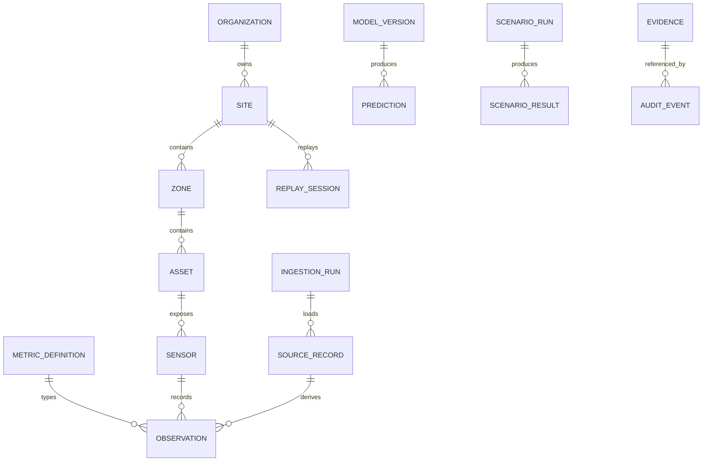

# Data Architecture and Contracts

## Source profile

| Source | Rows | Grain/coverage | MVP use |
|---|---:|---|---|
| GreenhouseClimate | 47,809 | 5 min; 2019-12-16–2020-05-30 | climate, controls, features |
| Weather | 47,809 | 5 min; same period | external drivers |
| GrodanSens | 47,809 | 5 min; ~4.8% missing | root-zone context |
| Resources | 166 | daily; 2019-12-16–2020-05-29 | energy/resource truth |
| CropParameters | 23 | weekly; ~21.7% median missing | context |
| Production | 24 | harvest events; one pre-window date to quarantine | contextual KPI |
| LabAnalysis | 10 | biweekly | context only |
| TomQuality | 8 | biweekly; irregular delimiter/header | context after parser validation |

DATA-01: retain source ZIP unchanged and record SHA-256, adapter version and ingestion run. Excel serial dates use origin `1899-12-30`, UTC storage, and source-local timezone metadata. Never silently repair source values.

DATA-02: quarantine the production pre-window record pending ReadMe/source confirmation; parse Tomato Quality with a dedicated tested adapter; drop no all-null column from raw, but exclude `t_grow_min_sp` from curated features; preserve all frequencies and join only with declared as-of/window semantics.

## Canonical model

Core tables: `organization`, `site`, `zone`, `asset`, `sensor`, `metric_definition`, `unit`, `observation`, `setpoint`, `ingestion_run`, `source_record`, `quality_issue`. Every tenant table contains `organization_id`; operational tables also contain `site_id`. Observations use `(site_id, metric_id, observed_at, source_record_id)` uniqueness and fields `value`, `unit_id`, `quality_state`, `recorded_at`.

Analytical tables: `kpi_definition/version/result`, `model/version/run/prediction`, `anomaly_event`, `constraint_set/version`, `scenario/run/result`, `recommendation`, `evidence`, `replay_session`, `audit_event`.

Required identifier conventions: UUID primary keys; human-readable immutable `code` for metrics/units; `created_at` and `created_by` on governed records; `valid_from/valid_to` for definitions; numeric observations stored as double precision plus explicit unit. Soft deletion is prohibited for source/audit evidence; master data may use `archived_at`.

Schemas/layers:

- `raw`: immutable payload and file metadata.
- `validated`: typed source-shaped records plus quality results.
- `curated`: canonical observations/setpoints and conformed units.
- `features`: point-in-time-correct feature snapshots.
- `analytics`: approved KPI/model/scenario outputs.
- `audit`: append-only access and decision evidence.

## Pipeline contract

`discover → hash → stage → parse → validate → quarantine → conform units/time → upsert idempotently → reconcile → publish dataset_version`. A failed reconciliation publishes nothing. Reports include input/accepted/rejected counts, min/max time, duplicates, missingness, range/unit failures and checksums. Re-running the same file+adapter is a no-op.

RLS denies by default. Browser access is limited to security-invoker views/RPCs; service-role credentials remain server-side. Index time series on `(organization_id, site_id, metric_id, observed_at desc)` and partition only after measured need.

## Quality rules and reconciliation

| Rule | Failure handling |
|---|---|
| Timestamp parses, is unique at source grain and falls within declared source coverage | Reject/quarantine; never coerce to current time |
| Unit is known and dimension-compatible with metric | Reject record and block dataset publication |
| Required value is finite and within physical/domain bounds | Mark invalid; preserve raw value |
| Five-minute sources align on timestamp without future lookup | Mark gap; no backward fill across replay cursor |
| Daily resource totals reconcile to source within `1e-9` before conversion | Block publication |
| Adapter output count = accepted + quarantined + rejected | Block publication |

Dataset version format is `source_sha256.adapter_semver.contract_semver`. Publication writes a frozen reconciliation report and feature cutoff policy. Schema migrations are forward-only, transactional where PostgreSQL permits, tested from empty and previous release, and include explicit rollback or roll-forward instructions.
