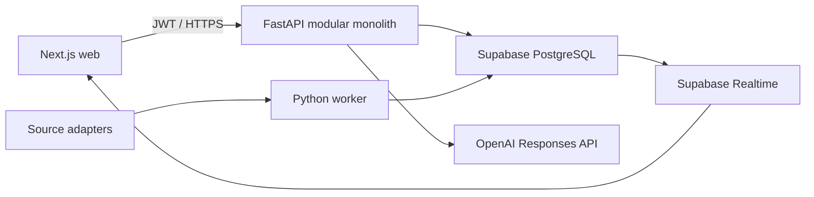

# Solution Architecture

## Runtime design



Backend modules are `identity`, `catalog`, `ingestion`, `timeseries`, `energy`, `climate`, `replay`, `analytics`, `scenarios`, `agent`, and `audit`. Modules communicate through application interfaces and shared IDs, not cross-module table writes. The worker imports those same domain services; extraction to services is deferred until scaling evidence exists.

## Interfaces

All endpoints are `/api/v1`, JSON, tenant derived from JWT, ISO-8601 UTC timestamps, cursor pagination, idempotency key on writes, and RFC 9457-style problem responses.

- `GET /timeseries?site_id&metric_ids&from&to&interval`
- `GET /kpis`, `/anomalies`, `/forecasts` with site/time/version filters
- `POST /replay-sessions`; `PATCH /replay-sessions/{id}` with action and expected revision
- `POST /scenarios:preview`; `POST /scenarios/{id}:confirm`
- `POST /agent/responses` streams text/tool status; confirmation token required for scenario persistence
- `GET /evidence/{id}` and `POST /exports`

Canonical envelope:

```json
{"data": {}, "meta": {"request_id": "uuid", "session_id": "uuid", "revision": 12, "data_version": "string"}}
```

Errors use `application/problem+json` with `type`, `title`, `status`, `detail`, `instance`, `request_id` and stable `error_code`. `409 replay_revision_conflict` returns the authoritative revision. Mutations require `Idempotency-Key`; identical key/body returns the original result, while key reuse with a different body returns 409.

Scenario preview request contains `site_id`, `session_id`, `revision`, `horizon`, `changes[{metric_code,value,unit}]` and `constraint_set_version`. Response contains `scenario_id`, baseline/candidate, deltas, quantiles, constraint margins, feasibility, extrapolation score, assumptions and evidence IDs. Confirm accepts only `scenario_id`, immutable preview hash and confirmation token.

Replay session stores dataset version, historical cursor, speed (`0.25,1,5,20,60`), state, owner and monotonic revision. Server derives virtual time from cursor anchor plus elapsed wall time; seek/pause commits a new revision. Realtime broadcasts lightweight invalidation/session events, while clients fetch authoritative API state.

## Security and operations

- Supabase Auth + RLS; `viewer`, `operator`, `analyst`, `admin`, `approver` claims checked again in FastAPI.
- Secrets only in environment/secret manager. Browser receives publishable key, never service role or OpenAI key.
- Structured logs with correlation ID; metrics for latency, errors, queue lag, tool cost, model drift and replay fanout.
- Local uses Supabase CLI-compatible migrations and seeded data; staging validates migrations/evals; demo uses managed Supabase and containerized web/API/worker.
- CI gates: lint/type/test, migration reset+seed, RLS tests, data reconciliation, ML/LLM eval thresholds and dependency/security scan.

The normative role matrix, SLOs, recovery targets and threat controls are in [NFR and Security](09-nfr-security.md). OpenAPI 3.1 generated from FastAPI is the executable API contract; CI rejects backward-incompatible changes unless the API major version changes.
